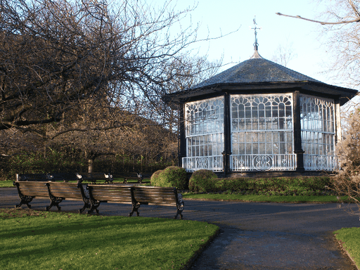
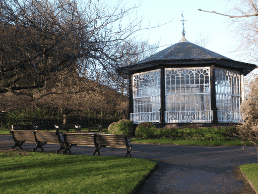
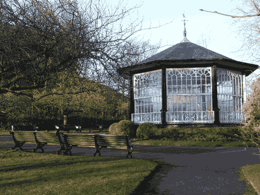

 

# TinyPNG-kmeans

一个 Python 程序，帮助你缩小 PNG 图像文件的大小 (类似 [tinypng.com](https://tinypng.com/)) 。优点有：

- 可调：通过调整参数，用画质换取更高的压缩率。
- 摆脱 [tinypng.com](https://tinypng.com/) 的文件数量限制。

|  |  |
| :----------------------------------: | :----------------------------------: |
|           原图，426530字节           |        256色压缩，128154字节         |
|    |    |
|         99色压缩，97921字节          |         16色压缩，54192字节          |

　

## 原理简介

#### 色域量化

与 [tinypng.com](https://tinypng.com/) 类似，本代码将色彩数=16777216 的24位真彩色像素量化为色彩数≤256的调色板像素，并使用 PNG 标准规定的调色板(palette) 模式 (color_type=3) 来存储量化后的图像，从而达到大于 3 倍的压缩比。

考虑到 PNG 的 color_type=3 模式只支持 RGB 调色板，本代码只能支持 RGB 图像压缩，对于 RGBA 图像，会先将它转化为 RGB 图像（alpha通道会丢失）。

本代码调用 [ImCvt](https://github.com/WangXuan95/ImCvt) v0.6 来将图像转化为色域量化模式的 PNG ，它使用 K-Means 聚类算法进行量化。

#### Deflate 极限压缩

本代码还调用了 [OptiPNG](https://optipng.sourceforge.net/) 。它会重新对 PNG 的 Deflate 压缩过程进行优化，从而达到更大的压缩比。

　

## 安装依赖

#### 安装 Python

需要安装 Python 3.x 以及其配套的 Pillow (PIL) 、 numpy 库。

如果你已有 Python 3.x ，运行以下命令安装这些库：

```powershell
python -m pip install Pillow==8.4.0
python -m pip install numpy==1.20.3
```

如果你还没有 Python ，你可以直接安装 [Anaconda](https://www.anaconda.com/products/distribution) ，它包含 python 和上述库。

#### 安装第三方工具

- 如果你的系统是Windows，要保证 `ImCvt.exe` 和 `optipng.exe` 与 `tinypng.py` 在同一个目录下。
- 如果你的系统是 Linux ，需要前往链接 https://github.com/WangXuan95/ImCvt 编译 ImCvt；前往链接 https://optipng.sourceforge.net/ 编译 OptiPNG ，并将编译产生的 Linux 可执行文件 `ImCvt` 和 `optipng` 放在与 `tinypng.py` 在同一个目录下。

　

## 使用方法

在 `tinypng.py` 所在的目录下运行命令：

```powershell
python tinypng.py <输入目录名> <输出目录名> <P>
```

它会把输入目录中的所有图像文件 (包括 png, jpg, tiff 等各种图像格式) 压缩成 png 格式，放在输出目录中。**P值**则是**色彩数**，取值范围是 `P∈[2,256]` ，越小则压缩率越高，图像失真也越大。

比如用以下命令来压缩 [image](./image) 目录中的图像，放到 [image_tiny]() 目录中，`P=100` ：

```powershell
python tinypng.py image image_tiny 100
```

> 对一般的图像、照片可以取 `P∈[100,256]` 。对色彩较少的图像（比如平面设计），可取 `P∈[2,99]` 来获得更好的效果。

　

## 失真评估

我们可以通过 SSIM 来评估量化压缩后的图像相比原始图像的失真。

这里提供了计算 SSIM 的代码文件 ssim.py ，运行方法是：

```powershell
python ssim.py <原始图像目录> <原始图像格式> <压缩图像目录> <压缩图像格式>
```

比如以下命令会计算 [image](./image) 目录中的 png 图像和 [image_tiny]() 目录中的同名的 png 图像的 SSIM 值：

```powershell
python ssim.py image png image_tiny png
```

